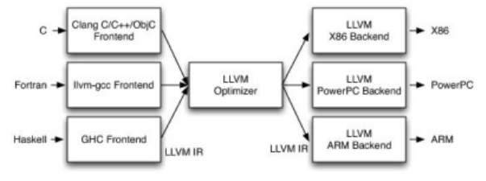
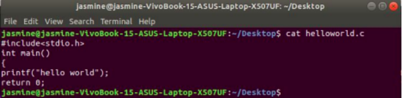
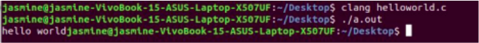
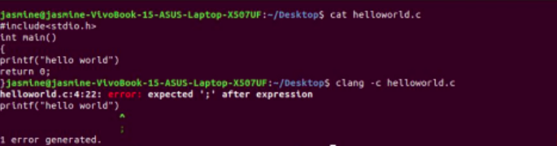
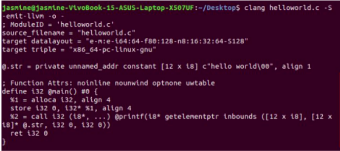
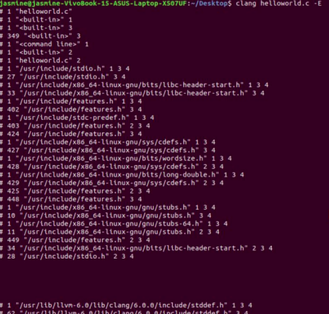
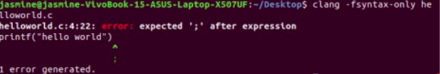

# AbstractSyntaxTreeInterpreter

## LLVM 

LLVM is an umbrella project that hosts and develops a set of close-knit low-level toolchain components (e.g., assemblers, compilers, debuggers, etc.), which are designed to be compatible with existing tools typically used on Unix systems. The name "LLVM" was once an acronym but is now just a brand for the umbrella project. While LLVM provides some unique capabilities and is known for some of its great tools (e.g., the Clang compiler, a C/C++/Objective-C compiler which provides a number of benefits over the GCC compiler), the main thing that sets LLVM apart from other compilers is its internal architecture. 

## LLVM's basic design principles 

LLVM is a notoriously didactic framework because of a high degree of organization in its several tools, which allows the curious user to observe many steps of the compilation. The design decisions go back to its first versions more than 10 years ago when the project, which had a strong focus on backend algorithms, relied on GCC to translate high-level languages, such as C, to the LLVM intermediate representation (IR). Today, a central aspect of the design of LLVM is its IR. It uses Single-Static Assignments (SSA), with two important characteristics: 
* Code is organized as three-address instructions 
* It has an infinite number of registers 
This does not mean, however, that LLVM has a single form of representing the program. Throughout the compilation process, other intermediary data structures hold the program logic and help its translation across major checkpoints. Technically, they are also intermediate forms of program representation. For example, LLVM employs the following additional data structures across different compilation stages:
* When translating C or C++ to the LLVM IR, Clang will represent the program in the memory by using an Abstract Syntax Tree (AST) structure (the TranslationUnitDecl class) 
* When translating the LLVM IR to a machine-specific assembly language, LLVM will first convert the program to a Directed Acyclic Graph (DAG) form to allow easy instruction selection (the SelectionDAG class) and then it will convert it back to a three-address representation to allow the instruction scheduling to happen (the MachineFunction class) 
* To implement assemblers and linkers, LLVM uses a fourth intermediary data structure (the MCModule class) to hold the program representation in the context of object files. 

## LLVM Infrastructure

To understand the LLVM project, you need to be aware of the most important parts of the infrastructure: 
* Frontend: This is the compiler step that translates computer-programming languages, such as C, C++, and Objective-C, into the LLVM compiler IR. This includes a lexical analyzer, a syntax parser, a semantic analyzer, and the LLVM IR code generator. The Clang project implements all frontend-related steps while providing a plugin interface and a separate static analyzer tool to allow deep analyses. 
* IR: The LLVM IR has both human-readable and binary-encoded representations. Tools and libraries provide interfaces to IR construction, assembling, and disassembling. The LLVM optimizer also operates on the IR where most part of optimizations is applied. 
* Backend: This is the step that is responsible for code generation. It converts LLVM IR to target-specific assembly code or object code binaries. Register allocation, loop transformations, peephole optimizers, and target-specific optimizations/transformations belong to the backend.




## Clang frontend 
The Clang project is known as the official LLVM frontend for C, C++, and Objective-C. 
The compiler frontend converts source code into the compiler's intermediate representation prior to target-specific code generation. Since programming languages have distinct syntax and semantic domains, frontends usually handle either a single language or a group of similar ones. Clang, for instance, handles C, C++, and objective-C source code inputs. 
Clang may also refer to up to three distinct entities: 
1. The frontend (implemented in Clang libraries). 
2. The compiler driver (implemented in the clang command and the Clang Driver library). 
3. The actual compiler (implemented in the clang -cc1 command). The compiler in clang -cc1 is not implemented solely with Clang libraries, but also makes extensive use of LLVM libraries to implement the middle- and backends of the compiler, as well as the integrated assembler.

As a programmer (not just a normal user!), you can access the full power of Clang by using it as a library in one of three ways, depending on how you wish to program. 

### Clang Plugin 
Your code is the plugin itself and is run as a completely new instance for each source file, meaning you cannot keep any global information or other contextual information across different source files (but you can still run it on multiple files sequentially). A plugin is run by passing some options to your build system (Clang, Make, etc) via command-line arguments. It’s almost like enabling an optimization in GCC (e.g., “-O1”). You won’t be able to run any custom task before or after a source file is analyzed. 

#### LibTooling (Clang Tool) 
Your code is a normal C++ program; it has a normal main() function as the entry point. LibTooling is usually for running analysis on some source code (multiple files, if you want) separately from your normal build process. A new instance of your analysis code (and a new AST) will be created for each new source file (much like a Clang Plugin), but you are able to maintain contextual information across each source file because data items like global variables will persist. Since you have a main() function, you can also run tasks before or after Clang has finished analyzing all of your source files. 

### LibClang 
LibClang is great when you need a stable API. Clang changes periodically, and if you use a Plugin or Libtooling, you might have to update your code to match Clang’s changes (but don’t let that discourage you!). If you need to access Clang’s API from a language other than C++ (like Python), you must use LibClang.
Note: LibClang does not give you full access to the AST (only high-level access), but the other two options do. Usually, you want full access to the AST. 

Frontend actions implementations: 

1 Display content of file

``` cat filename.c   ```



2 Compile the program and save executable a.out

```clang code.c ```



3 Display errors if any

```clang -c code.c ```



## The Clang AST 

Clang’s AST is different from ASTs produced by some other compilers in that it closely resembles both the written C++ code and the C++ standard. For example, parenthesis expressions and compile-time constants are available in an unreduced form in the AST. This makes Clang’s AST a good fit for refactoring tools. 
The top-level declaration in a translation unit is always the translation unit declaration. In this example, our first user-written declaration is the function declaration of “f”. The body of “f” is a compound statement, whose child nodes are a declaration statement that declares our result variable, and the return statement. 

### AST Context 
All information about the AST for a translation unit is bundled up in the class ASTContext. It allows traversal of the whole translation unit starting from getTranslationUnitDecl, or to access Clang’s table of identifiers for the parsed translation unit. 
### AST Nodes 
Clang’s AST nodes are modeled on a class hierarchy that does not have a common ancestor. Instead, there are multiple larger hierarchies for basic node types like Decl and Stmt. Many important AST nodes derive from Type, Decl, DeclContext or Stmt, with some classes deriving from both Decl and DeclContext. 
There are also a multitude of nodes in the AST that are not part of a larger hierarchy, and are only reachable from specific other nodes, like CXXBaseSpecifier. 
Thus, to traverse the full AST, one starts from the TranslationUnitDecl and then recursively traverses everything that can be reached from that node - this information has to be encoded for each specific node type. This algorithm is encoded in the RecursiveASTVisitor. See the RecursiveASTVisitor tutorial. 
The two most basic nodes in the Clang AST are statements (Stmt) and declarations (Decl). Note that expressions (Expr) are also statements in Clang’s AST.
Clang actions to analyse code 

```clang -Xclang -ast-dump -fsyntax-only helloworld.c ```

-ast-dump displays the abstract syntax tree of the code. 

The AST is built using three groups of core classes: declarations, statements and types. If you follow the links to the doxygen, you'll see that these three classes form the base of a range of specializations. However, it is important to note that they do not inherit from a common base class. As a result, there is no common interface for visiting all the nodes in the tree. Each node has dedicated traversal methods that allow you to navigate the tree. Further on I'll show how we can use visitors to do so efficiently, without needing a common API.

```clang -cc1 -dump-tokens helloworld.c ```

Displays the list of tokens, their types and their location in the code 

-emit-llvm : Returns the code in LLVM Intermediate Representation format



clang helloworld.c -E 
Preprocesses the code



clang -fsyntax-only helloworld.c 
Typechecking for syntax 




## AST Interpreter Project 
This project first creates the AST for a given code and then the second component of the project interprets it and executes the executable to run the code. The second component works the same irrespective of the method using which the Abstract Syntax Tree was created. 
It uses ASTConsumer which is an abstract interface that is implemented by clients that read ASTs. 
The project, basically a toy code, an AST interpreter, based on Calng & LLVM, that only support integer type. It supports basic modules and array, e.g. ifstmt, whilestmt, function call, malloc and array. 
First use the command 
make which will get the ASTInterpreter ready to be executed. 
Secondly, use 
./ast-interpreter "`cat ./test/test_file_name`" 
The environment.h is included in the main code to set the value of environment variables as per need. 
Makefile is the file created after building/using make. 
ASTInterpreter.cpp is the main code of the project that takes as argument the test code and creates its AST file and then interprets it and gives output of code.


